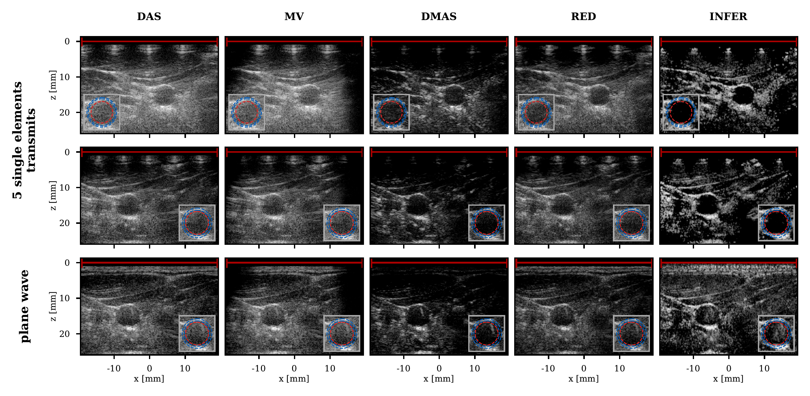

# Off-Grid Ultrasound Imaging by Stochastic Optimization
This is the code repository accompanying the paper [Off-Grid Ultrasound Imaging by Stochastic Optimization](https://arxiv.org/abs/2407.02285).
INverse grid-Free Estimation of Reflectivities (INFER) is a method for off-grid ultrasound imaging. Instead of beamforming RF data, we construct a matrix-free forward model of the acquisition process and optimize for the reflectivities, backscatter source locations, and other tissue and transducer parameters directly.

## Installing the dependencies
The code was tested with python 3.10. The dependencies can be installed by running
```bash
pip install -r requirements.txt
```
After that you also need to install JAX. To install JAX, please refer to the [official installation guide](https://jax.readthedocs.io/en/latest/installation.html).
At the time of writing the command to install JAX is
```bash
pip install -U "jax[cuda12]"
```

## Downloading the data
The data can be downloaded from the [Zenodo repository](https://zenodo.org/records/12647175).
The files should be placed in the `data` folder.

## Running the code
### Running an example
The script `run_example.py` runs the optimization on the phantom data.
```bash
python3 run_example.py
```

### Generating the results from the paper
To reproduce the plots from the paper, run the script `run_generate_paper_results.py`. This will run all the experiments with INFER and the baselines. The generated figures will be placed in the `results/figures` folder. Be aware that this will take some time.
```bash
python3 run_generate_paper_results.py
```