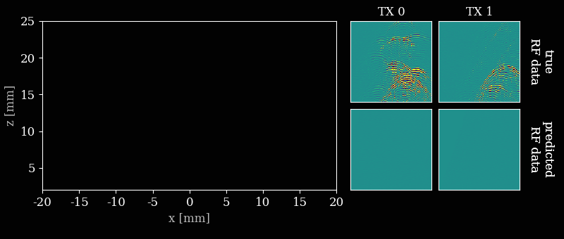

# Off-Grid Ultrasound Imaging by Stochastic Optimization
This is the code repository accompanying the paper [Off-Grid Ultrasound Imaging by Stochastic Optimization](https://arxiv.org/abs/2407.02285).
INverse grid-Free Estimation of Reflectivities (INFER) is a method for off-grid ultrasound imaging. Instead of beamforming RF data, we construct a matrix-free forward model of the acquisition process and optimize for the reflectivities, backscatter source locations, and other tissue and transducer parameters directly.



## Installing the dependencies
The code was tested with python 3.10. The dependencies can be installed by running
```bash
pip install -r requirements.txt
```
After that you also need to install JAX. To install JAX, please refer to the [official installation guide](https://jax.readthedocs.io/en/latest/installation.html).
At the time of writing the command to install JAX is
```bash
pip install -U "jax[cuda12]"
```

## Running in docker
### Building the docker image
To run the code in a docker container, you can use the provided `Dockerfile`. Build the docker image with the following command (from the root of the repository): 
```bash
docker build -t infer --build-arg USERNAME=myname .
```

Replace `myname` with your username.

If you want to use your own user ID and group ID (to avoid permission issues with the mounted volumes), you can pass the `USER_ID` and `GROUP_ID` build arguments. You can find your user ID and group ID by running `id -u` and `id -g` in your terminal, respectively.
For example, if your user ID is `1000` and your group ID is `1000`, you can build the docker image with the following command:

```bash
docker build -t infer --build-arg USERNAME=myname --build-arg USER_ID=1000 --build-arg GROUP_ID=1000 .
```

### Running the docker container
```bash
docker run --hostname vm --gpus all -v $(pwd):/working_directory -it infer bash
```

## Downloading the data
Download the data files from the [Zenodo repository](https://zenodo.org/records/14925758) and place them in the `data` folder.

Alternatively (on linux or in docker) you can use the script `shell/get-data.sh` from the root of the repository.

## Running the code
### Running an example
```bash
python main.py config/regular_runs/carotid/carotid_sa_1.yaml
```
